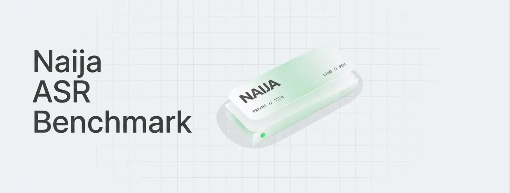

# Naija ASR Benchmark

<div align="center" style="border: 2px solid #ccc; border-radius: 8px; padding: 4px; max-width: 900px;">
  
</div>

[](https://dev.to/challenges/kaggle-2026-09-23)

A dialect-aware ASR error taxonomy benchmark for Nigerian English and Pidgin — measuring whether standard Word Error Rate (WER) overestimates real ASR failures by penalizing faithful dialect transcription.

## Results

| Metric | Whisper large-v3 | Whisper small | Accent Labs fine-tuned |
|--------|---------:|--------:|--------:|
| Raw WER (original, unfixed — 500 samples) | 41.92% | 48.00% | 11.11% |
| Raw WER (punctuation stripped — 500 samples) | 35.05% | 41.19% | 8.30% |
| Raw WER (punctuation stripped — 160 held-out) | 39.50% | 44.52% | 7.11% |
| Faithful WER | 35.05% | 41.19% | 8.00% |
| Dialect Penalty | 0.00 | 0.00 | 0.30 |
| Hallucination Rate | 100.0% | 100.0% | 96.43% |
| Normalization Overcorrection | 23.5% | 18.5% | 10.2% |

## Setup

```bash
pip install -r requirements.txt
```

## Usage

**Compute WER:**
```bash
python scripts/compute_benchmark_wer.py --dry-run
python scripts/compute_benchmark_wer.py
```

**Compute dialect-aware metrics:**
```bash
python scripts/compute_benchmark_metrics.py --dry-run
python scripts/compute_benchmark_metrics.py
```

**Visualize results:**
Open `notebooks/kaggle_benchmark_viz.ipynb`

**Run inference on Kaggle:**
See `notebooks/kaggle_benchmark_inference.ipynb` and `kaggle.md`

## Repository Structure

```
├── scripts/                   # Analysis & inference scripts
├── notebooks/                 # Jupyter notebooks (Kaggle inference + viz)
├── data/kaggle_benchmark/
│   ├── dataset/               # Test samples (no audio paths)
│   ├── model_outputs/         # Hypothesis CSVs for 3 models
│   ├── annotations/           # Annotation guide + word alignment
│   └── analysis/              # Results JSON & per-dialect metrics
├── config.yaml                # Benchmark configuration
├── requirements.txt           # Python dependencies
└── kaggle.md                  # Kaggle submission description
```

## License

CC-BY-4.0

## Kaggle Notebook

[Naija ASR Benchmark Inference Notebook](https://www.kaggle.com/code/nadinev6/notebook6e01805d52)